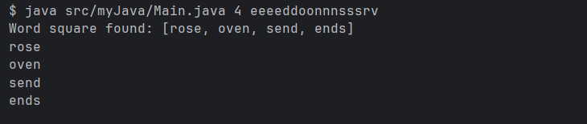

# Word Square Challenge 

## Description
This Java program generates valid english words when given a set of letters and a grid size (n*n).

## Requirements 
- JAVA 17+
- Dictionary file like "words.txt" - included in this project

## Project Structure
src/myJava/test
myJava/*.java
test/WordHelperTest

words.txt <- dictionary file

## How to Run
From the project root, compile and run:

```bash
javac -d out src/myJava/*.java
java -cp out myJava.Main 4 eeeeddoonnnsssrv
```

## Example Input & Output

** Input **
4 eeeeddoonnnsssrv

** Possible output **
rose
oven
send
ends

## Screenshot



